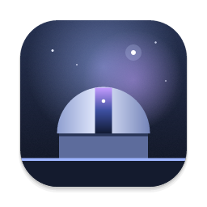

<p align="center">
  
</p>

<h1 align="center">Observatory</h1>

<p align="center">
  A macOS desktop client for <a href="https://github.com/AgentSystemLabs/nebula">nebula</a>, the
  daemon that runs your coding agents across a project's git worktrees.
</p>

<p align="center">
  
</p>

It talks to the same daemon as the `nebula` TUI, so both can be open at once on the same sessions.
Close either one and your agents keep running.

## Install

**[Download Observatory](https://github.com/yobazy/observatory/releases/latest/download/Observatory.dmg)**
(macOS, Apple Silicon and Intel), open it, and drag the app into Applications.

The first time you open it, it installs [nebula](https://github.com/AgentSystemLabs/nebula) for you,
at the exact version the app is built for, and starts it. You'll also want an agent CLI for nebula
to run, such as [Claude Code](https://code.claude.com/docs/en/setup).

After that it keeps itself up to date: a new version downloads in the background, and **Restart to
update** appears at the bottom of the sidebar. Your agents keep running while it restarts.
Settings → General shows the version you're on and can check right away.

### Or build it yourself

One command installs the build tools it needs, nebula, and the app:

```sh
curl -fsSL https://raw.githubusercontent.com/yobazy/observatory/main/scripts/setup.sh | bash
```

Or from a clone: `./scripts/setup.sh`. It checks for Xcode's command line tools, Node 20+ and
Rust (offering to install what's missing), installs nebula at the pinned version (asking before it
replaces a different one), builds the app into `/Applications`, and opens it. `--check` shows what
it would do without changing anything, and `--help` lists the other options.

## What it does

**Sessions**


- **Projects sidebar**: filter it with `⌘P` and jump with `⌘1`–`⌘9`. Each project shows one bar
  segment per session, a spinner with the number of tasks in progress, and badges for tasks waiting
  on you and finished ones you haven't read. `⌘O` adds a project from a folder, with the TUI's
  checks (already a project, missing folder, not a git repo).
- **Waiting on you**: every session blocked on a permission prompt or a question, across all
  projects. `⌘J` cycles through them, and you get a macOS notification and a dock badge.
- **Worktree bands**: sessions grouped by branch, with the ones that need you first. Switching
  projects brings back the session you last had open there.
- **Terminal**: attach to any agent or shell. Shift+Enter inserts a newline in Claude Code.
- **Right-click a task** for the TUI's menu: follow-up prompt, restart, duplicate, rename,
  archive, run or stop the dev server, open the worktree, delete.
- **Hide either column** with `⌘B` (projects) and `⌥⌘B` (tasks), or drag them to resize.
- **New task** (`⌘N`): on an existing branch or a new worktree (the branch name is suggested from
  the task), with your choice of agent and preset.
- **Moved a project's folder?** Its row says the folder is missing, and **Locate…** points the
  project at the new place, carrying its icon, color, settings and Claude Code history with it
  (this needs a nebula release with `SetProjectPath`; until then it says so). Right-click a
  project to **Remove from list**; nothing on disk is touched.

**Previews**

- **Paths in a terminal light up.** Rest the pointer on one an agent printed (an HTML mockup, a
  Markdown doc, an image, a PDF) for a preview card, and click to open it. Paths are absolute,
  `~/`, or relative to the task's checkout, and a long path the agent's CLI broke across lines
  still counts.
- **The preview opens over the terminal, or beside it** (Settings › General › Previews). HTML
  mockups render with their own CSS, images and scripts, at phone, tablet or full width; Markdown
  reads as a document. When the agent edits the file, the preview updates on its own.
- **`nebula open <file>`** from an agent opens the file there too.
- Previews only reach files you open, and pages run sandboxed, away from the app.

**Git and shipping**

- Each band shows where its branch stands: files changed with lines added and removed, commits to
  push, a branch that was never pushed, commits behind, merge conflicts, and a remote branch that's
  been deleted.
- **Commit & push**, **Push** or **Resolve** hands the job to an idle agent on that branch, or
  starts one. It waits while an agent there is still mid-turn, so nothing gets committed half-done.

**Running the project**

- **Start** runs the project's run command (the Project setting, or `run` in `.nebula.json`) in the
  worktree's run terminal. Once the dev server prints its address, the band shows it as a link.
- No run command yet? Type one, or ask an agent to work it out and write `.nebula.json`.

**Agent usage** (`⌘U`)


Usage across Claude Code, Codex, Pi, and OpenCode: today, 7 or 30 days, by agent, project,
task, and day. Click an agent to filter or a task to open it. The sidebar shows today's known
cost across agents. Recent activity covers the current hour and the previous four hours;
it is not a provider's quota window.

The collectors read local histories without modifying them:

- Claude Code: `~/.claude/projects` (or `CLAUDE_CONFIG_DIR/projects`).
- Codex: `~/.codex/sessions` and `archived_sessions` (or under `CODEX_HOME`).
- Pi: `~/.pi/agent/sessions` (or `PI_CODING_AGENT_DIR/sessions`).
- OpenCode: `~/.local/share/opencode/opencode.db` (or under `XDG_DATA_HOME`), read-only.
  Both `message` and `session_message` database schemas are supported; legacy JSON storage is not.

Pi and OpenCode supply recorded costs; other costs use known standard model rates. Unknown
models still count toward token totals and show as unpriced, rather than receiving a guessed
rate. Budgets use known costs only. These estimates are not subscription charges or plan caps.
Service tiers, long-context premiums, and other provider charges can differ.

Cursor, Muse, Grok, and custom-agent usage is not collected yet. Their status is explicitly
shown in the window, alongside missing histories and read errors, so missing usage isn't
presented as measured zero usage.

**Settings** (`⌘,`)


Every tab of the TUI's settings, written to the same files the same way, so a change in either
app shows up in the other. Rows that only affect the TUI's look are tagged. The color theme is
shared with the TUI; System, Dark, Black and Light are for the desktop app, and the terminal
follows them.

**And** a pixel cat that plays at the bottom of the sidebar. It chases a
yarn ball, naps, and sits up when an agent starts waiting on you. Click it to say hi, or turn it
off in Settings.

## Building from source

```sh
npm install
npm run tauri dev      # against your real nebula daemon
npm run tauri build    # .app in src-tauri/target/release/bundle/macos
```

The app connects to the daemon the TUI uses (`nebula` starts it; the app offers to as well).

## Version pinning

The daemon only accepts clients built with its exact `PROTOCOL_VERSION`. `nebula-core` is pinned
by tag in `src-tauri/Cargo.toml`:

```toml
nebula-core = { git = "https://github.com/AgentSystemLabs/nebula", tag = "v0.40.2" }
```

After `nebula upgrade`, bump the tag and rebuild (`./scripts/setup.sh` picks up the new tag and
checks your nebula matches it). If the protocol changed, `src/nebula/types.ts`
may need the same change; the e2e check below catches drift. On a mismatch the app shows a
"doesn't match" screen rather than misbehaving.

## Developing without touching your sessions

`scripts/sandbox.sh` runs a throwaway daemon with its own socket, database and settings, two demo
repos, and a fake agent CLI (`scripts/fake-agent.sh`) that fires nebula's status hooks instead of
calling a model. In a fake agent, type `ask …` to make it wait on you.

```sh
scripts/sandbox.sh app    # the app against the sandbox
scripts/sandbox.sh e2e    # protocol check: worktree, agent, attach, input, statuses
scripts/sandbox.sh stop
```

`npm run dev` on its own serves a browser preview with demo data and a canned terminal. It's
handy for styling, and needs no daemon. The screenshots and the demo above are from it.

## Layout

- `src-tauri/src/daemon.rs`: the socket connection. It forwards daemon events to the webview,
  with terminal output sent separately as base64.
- `src-tauri/src/git.rs`: a checkout's git state (the daemon doesn't report it).
- `src-tauri/src/usage.rs` and `usage_sources.rs`: collect local agent usage into hourly buckets.
- `src/nebula/usageData.ts`: pricing and attribution; `npm run test:usage` runs its tests (Node 22+).
- `src-tauri/src/settings.rs`: writes nebula's settings the way the TUI does.
- `src/nebula/`: typed protocol mirror, store, client (request/Ack routing), notifications, and
  the git, usage, runs, settings and theme logic.
- `src/components/`: sidebar, sessions column, terminal pane, dialogs, usage and settings views,
  and the cat (`petBrain.ts` is its behavior, separate from the drawing).
- `src-tauri/icons/app-icon.svg`: the icon's source. Regenerate the set with
  `npx tauri icon src-tauri/icons/app-icon.svg`.
- `scripts/dmg-background.py`: draws the DMG window's background; the layout is under
  `bundle.macOS.dmg` in `src-tauri/tauri.conf.json`.

## Releasing

Releases are signed with a Developer ID Application certificate and notarized by Apple, so they
open without the "Open Anyway" step. You need the certificate in your keychain (Xcode → Settings →
Accounts → Manage Certificates → + → Developer ID Application) and an app-specific password from
appleid.apple.com.

```sh
./scripts/release.sh --setup     # once: saves your Apple ID and app-specific password to the keychain
./scripts/release.sh             # universal build, signed, notarized, stapled and verified
./scripts/release.sh --publish   # the same, then gh release create v<version>
```

It writes `Observatory.dmg` at the repo root, the asset name the README's download link points at.
Bump the version in `src-tauri/tauri.conf.json`, `src-tauri/Cargo.toml` and `package.json` first.

Each release also carries `Observatory.app.tar.gz`, signed with the updater key, and `latest.json`,
which installed copies check (`plugins.updater` in `tauri.conf.json`). The key is
`~/.tauri/observatory.key`, with its password in the login keychain under
`dev.bazil.observatory.updater`. Back up both: without them, installed copies can't be updated, and
a new key means everyone downloads the DMG again.
